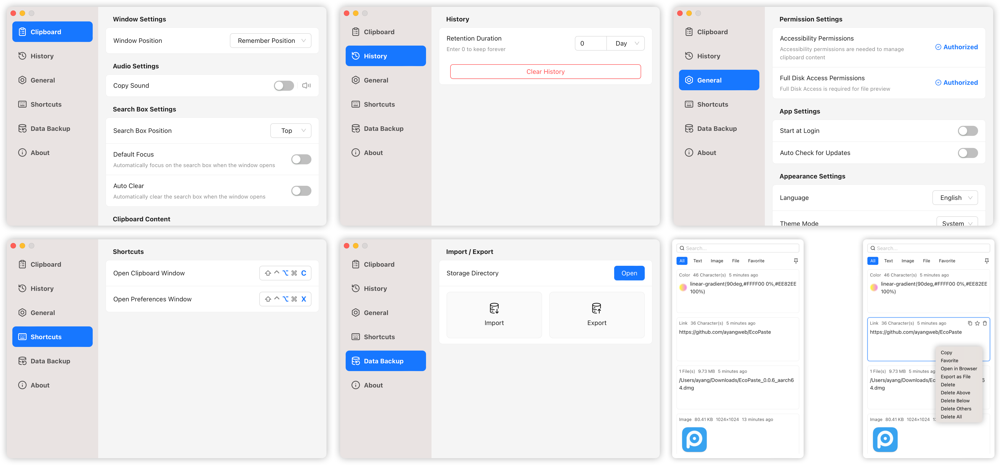

<div align="center">
  
  <h1>PasteX</h1>
  <p>✨ A Modern, High-Performance Cross-Platform Clipboard Manager</p>
</div>

<div align="center">
  <br/>
  <div>
      <a href="./README.md">简体中文</a> | <a href="./README.zh-TW.md">繁體中文</a> | English | <a href="./README.ja-JP.md">日本語</a>
  </div>
  <br/>
</div>

<div align="center">
  <picture>
    <source media="(prefers-color-scheme: dark)" srcset="./static/app-dark.en-US.png" />
    <source media="(prefers-color-scheme: light)" srcset="./static/app-light.en-US.png" />
    
  </picture>
</div>

## 🚀 Introduction

PasteX is a lightweight, open-source clipboard manager built with Tauri v2. It inherits cross-platform capabilities and high performance while introducing more precise data management and modern UI design to help you efficiently manage every copy and paste.

## ✅ Key Features

- **🏷️ Tags and Combined Filters**: Find history by source app, colored tags, and date range.
- **🔍 Source Tracking**: Identify the source application and display its system icon.
- **⚡ Sequential Paste**: Queue multiple items and paste them in order with a global shortcut.
- **🧹 Content Processing**: Mask sensitive data, apply custom regex cleaning, and write back external edits.
- **📂 Multiple Content Types**: Manage text, rich text, images, links, files, and paths.
- **🪟 Modern Interaction**: Quickly open copied links, follow the pointer, and auto-hide at screen edges.
- **🚀 High Performance**: Built with Rust and Tauri for low resource usage and fast startup.
- **🔒 Local First**: Data stays local by default and connects to a chosen sync service only after the user configures and enables sync.

## 📦 Download & Install

Please visit the [GitHub Releases](https://github.com/yixing233/PasteX/releases) page to download the latest version.

Supported Platforms:
- **Windows** (x64)

> More platforms support is coming soon...

## 🛠️ Local Development

If you want to contribute or build it yourself:

```bash
# Clone the repository
git clone https://github.com/yixing233/PasteX.git
cd PasteX

# Install dependencies
pnpm install

# Start development server
pnpm tauri dev

# Build the application
pnpm tauri build
```

## 📄 License

This project is licensed under Apache License 2.0. See [Open-source Acknowledgements](./ACKNOWLEDGEMENTS.md) for third-party projects and components.
