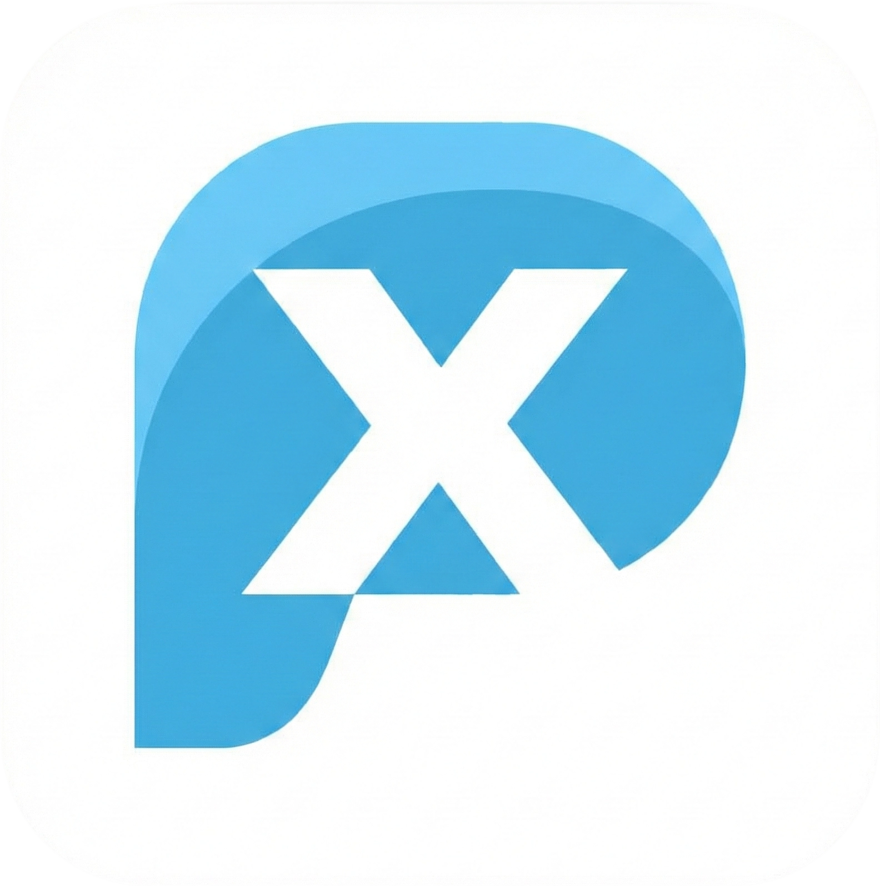
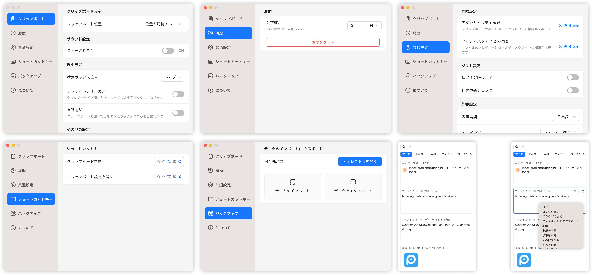

<div align="center">
  
  <h1>PasteX</h1>
  <p>✨ 現代的で高性能なクロスプラットフォーム・クリップボードマネージャー</p>
</div>

<div align="center">
  <br/>
  <div>
      <a href="./README.md">简体中文</a> | <a href="./README.zh-TW.md">繁體中文</a> | <a href="./README.en-US.md">English</a> | 日本語
  </div>
  <br/>
</div>

<div align="center">
  <picture>
    <source media="(prefers-color-scheme: dark)" srcset="./static/app-dark.ja-JP.png" />
    <source media="(prefers-color-scheme: light)" srcset="./static/app-light.ja-JP.png" />
    
  </picture>
</div>

## 🚀 概要

PasteX は、Tauri v2 で構築された軽量でオープンソースのクリップボード管理ツールです。クロスプラットフォーム、高性能の特徴を継承しつつ、より精緻なデータ管理と現代的な UI デザインを導入し、コピー＆ペーストを効率的に管理できます。

## ✅ 主な機能

- **🏷️ タグと複合フィルター**：カラータグ、コピー元アプリ、日付範囲で履歴を素早く絞り込み。
- **🔍 ソース追跡**：コピー元アプリを識別し、対応するシステムアイコンを表示。
- **⚡ 順次貼り付け**：複数項目をキューに追加し、グローバルショートカットで順番に貼り付け。
- **🧹 コンテンツ処理**：機密情報のマスキング、正規表現クリーニング、外部編集の自動反映に対応。
- **📂 複数形式**：テキスト、リッチテキスト、画像、リンク、ファイル、パスを管理。
- **🪟 モダンな操作**：リンクのクイックオープン、ポインター追従、画面端での自動収納に対応。
- **🚀 高性能**：Rust と Tauri により、低いリソース使用量と高速な起動を実現。
- **🔒 ローカル優先**：データは既定でローカルに保存され、ユーザーが同期を設定して有効化した場合のみ指定の同期サービスへ接続します。

## 📦 ダウンロードとインストール

[GitHub Releases](https://github.com/yixing233/PasteX/releases) ページから最新バージョンをダウンロードしてください。

サポートされているプラットフォーム：
- **Windows** (x64)

> その他のプラットフォームも順次対応予定...

## 🛠️ ローカル開発

開発に参加したい場合、または自分でビルドしたい場合：

```bash
# リポジトリをクローン
git clone https://github.com/yixing233/PasteX.git
cd PasteX

# 依存関係をインストール
pnpm install

# 開発環境を起動
pnpm tauri dev

# アプリケーションをビルド
pnpm tauri build
```

## 📄 ライセンス

本プロジェクトは Apache License 2.0 を使用します。第三者プロジェクトとコンポーネントについては[オープンソース謝辞](./ACKNOWLEDGEMENTS.md)を参照してください。
