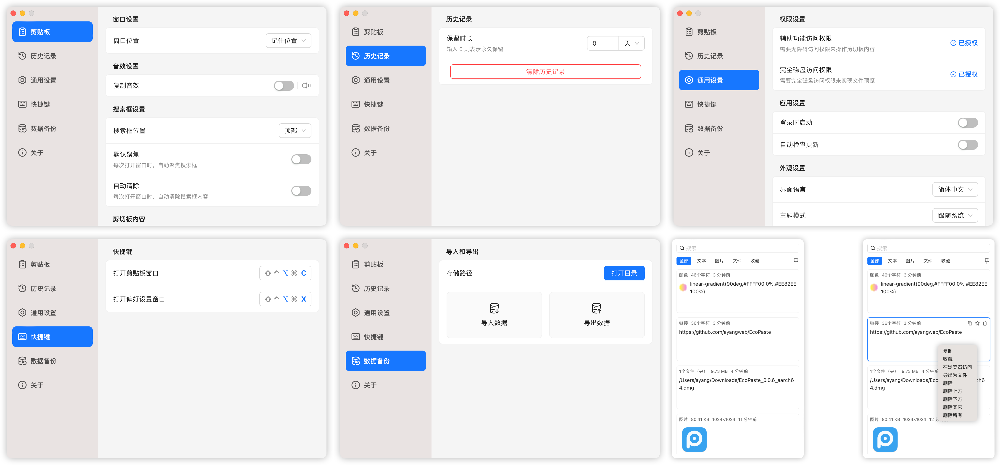

<div align="center">
  
  <h1>PasteX</h1>
  <p>✨ 一款现代化、高性能的跨平台剪贴板管理工具</p>
</div>

<div align="center">
  <br/>
  <div>
      简体中文 | <a href="./README.zh-TW.md">繁體中文</a> | <a href="./README.en-US.md">English</a> | <a href="./README.ja-JP.md">日本語</a>
  </div>
  <br/>
</div>

<div align="center">
  <picture>
    <source media="(prefers-color-scheme: dark)" srcset="./static/app-dark.zh-CN.png" />
    <source media="(prefers-color-scheme: light)" srcset="./static/app-light.zh-CN.png" />
    
  </picture>
</div>

## 🚀 简介

PasteX 是一个基于 Tauri v2 构建的轻量级开源剪贴板管理工具，提供精细的数据管理和现代化界面，帮助你高效管理每一次复制粘贴。

## ✅ 核心特性

- **🏷️ 标签与组合筛选**：使用多色标签，并按来源应用、标签和日期快速定位历史记录。
- **🔍 来源追踪**：识别复制内容的来源应用，并显示对应的系统图标。
- **⚡ 顺序粘贴**：将多个条目加入队列，通过全局快捷键依次粘贴。
- **🧹 内容处理**：支持敏感信息脱敏、自定义正则清洗和外部编辑器自动回写。
- **📂 多类型记录**：管理文本、富文本、图片、链接、文件和路径等内容。
- **🪟 现代化交互**：支持链接快捷打开、窗口跟随鼠标和屏幕边缘停靠自动收起。
- **🚀 高性能**：基于 Rust + Tauri 构建，资源占用低，启动响应迅速。
- **🔒 本地优先**：数据默认保存在本地；只有在用户主动配置并启用同步后才会连接指定的同步服务。

## 📦 下载与安装

请前往 [GitHub Releases](https://github.com/yixing233/PasteX/releases) 页面下载最新版本。

目前支持平台：
- **Windows** (x64)

> 更多平台支持正在适配中...

## 🛠️ 本地开发

如果你想参与开发或自行构建：

```bash
# 克隆仓库
git clone https://github.com/yixing233/PasteX.git
cd PasteX

# 安装依赖
pnpm install

# 启动开发环境
pnpm tauri dev

# 构建安装包
pnpm tauri build
```

## 📄 开源协议

本项目使用 Apache License 2.0。第三方项目与组件说明请参阅[开源致谢](./ACKNOWLEDGEMENTS.md)。
