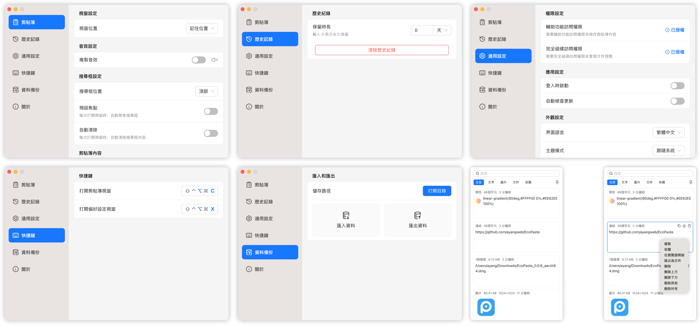

<div align="center">
  
  <h1>PasteX</h1>
  <p>✨ 一款現代化、高性能的跨平台剪貼板管理工具</p>
</div>

<div align="center">
  <br/>
  <div>
      <a href="./README.md">简体中文</a> | 繁體中文 | <a href="./README.en-US.md">English</a> | <a href="./README.ja-JP.md">日本語</a>
  </div>
  <br/>
</div>

<div align="center">
  <picture>
    <source media="(prefers-color-scheme: dark)" srcset="./static/app-dark.zh-TW.png" />
    <source media="(prefers-color-scheme: light)" srcset="./static/app-light.zh-TW.png" />
    
  </picture>
</div>

## 🚀 簡介

PasteX 是一個輕量級、開源的剪貼板管理工具，基於 Tauri v2 構建。它不僅繼承了跨平台、高性能的特點，還引入了更精細的數據管理和更現代化的 UI 設計，助你高效管理每一次複製貼上。

## ✅ 核心特性

- **🏷️ 標籤與組合篩選**：使用多色標籤，並依來源應用程式、標籤與日期快速定位歷史記錄。
- **🔍 來源追蹤**：識別複製內容的來源應用程式，並顯示對應的系統圖示。
- **⚡ 順序貼上**：將多個項目加入佇列，透過全域快速鍵依序貼上。
- **🧹 內容處理**：支援敏感資訊遮罩、自訂正則清理與外部編輯器自動回寫。
- **📂 多類型記錄**：管理文字、富文字、圖片、連結、檔案與路徑等內容。
- **🪟 現代化互動**：支援快速開啟連結、視窗跟隨游標與螢幕邊緣停靠自動收起。
- **🚀 高效能**：基於 Rust 與 Tauri 構建，資源佔用低且啟動快速。
- **🔒 本機優先**：資料預設保存在本機；只有使用者主動設定並啟用同步後才會連線至指定的同步服務。

## 📦 下載與安裝

請前往 [GitHub Releases](https://github.com/yixing233/PasteX/releases) 頁面下載最新版本。

目前支持平台：
- **Windows** (x64)

> 更多平台支持正在適配中...

## 🛠️ 本地開發

如果你想參與開發或自行構建：

```bash
# 複製倉庫
git clone https://github.com/yixing233/PasteX.git
cd PasteX

# 安裝依賴
pnpm install

# 啟動開發環境
pnpm tauri dev

# 構建安裝包
pnpm tauri build
```

## 📄 開源協議

本項目使用 Apache License 2.0。第三方專案與元件說明請參閱[開源致謝](./ACKNOWLEDGEMENTS.md)。
